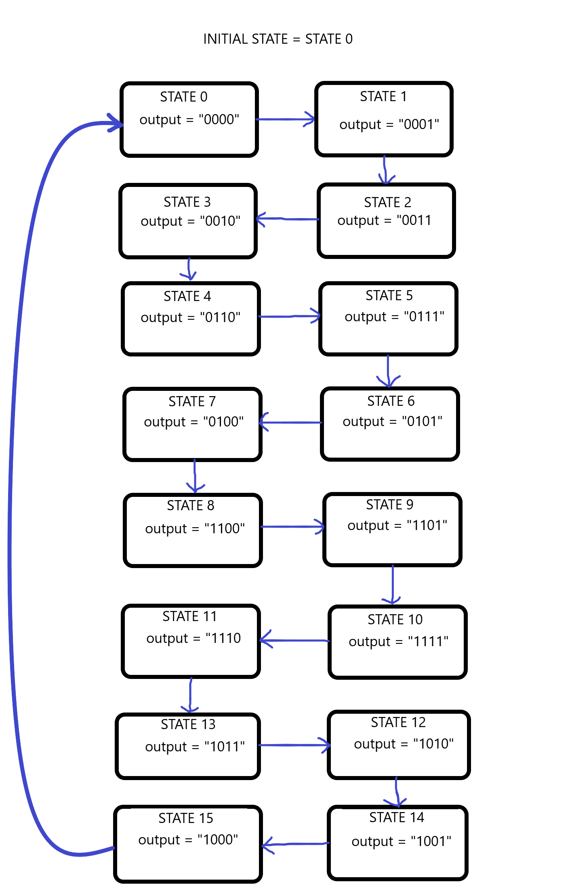

# 4-Bit Gray Code Counter

Design a 4-bit gray code counter using a finite state machine.

Gray code is a numerical system where two successive values differ by only a single bit. 
The binary sequence for the counter will be:

      0000    1100
      0001    1101
      0011    1111
      0010    1110      * NOTE: Table is read from top to bottom, left to right.
      0110    1010      * 0100 transitions to 1100. 1000 loops back around to 0000
      0111    1011
      0101    1001
      0100    1000

The counter will be designed using a 2-process model FSM. Each output will be represented as a state, so our FSM will have 2**4 states. 

The following screenshot depicts the states and their respective transitions:

# 4-Bit Up/Down Counter with Load

Design a 4- bit counter that counts upwards when an active-low input "up_n" ia asserted and count down otherwise.

* The counter will count from 0 - 15 and wrap back to 0 when exceeding 15. Similiarly, when counting down the count should warp to 15 once 0 is past.

* The counter will be able to load in an input value (in this case from the switches on the DE10-LITE) if active-low input "load_n" is asserted. The count will resume from the newly loaded value. Load_n takes priority over up_n.

* On reset, the count will start at 0.
* Both load_n and up_n are synchronous.
