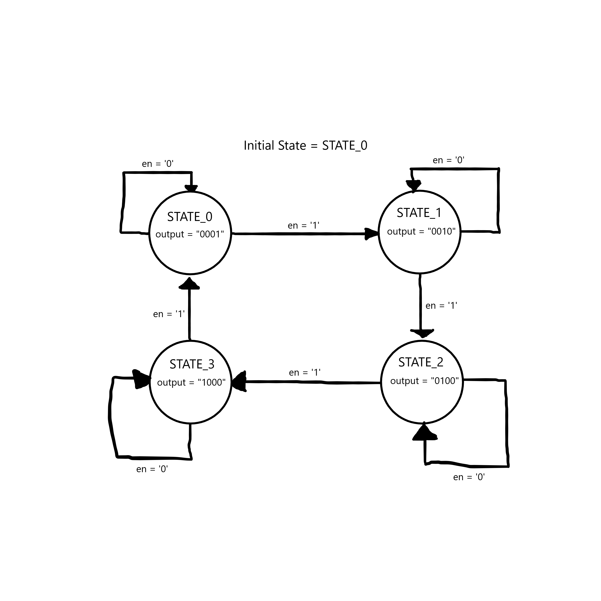

# Finite State Machines (FSMs)

An FSM transitions between states in response to inputs passed to the system. To model this level of abstraction in VHDL, FSM_1P and FSM_2P will be introduced.

## FSM 1 Process Model

The FSM_1P attempts to model the FSM in one process. The only flaw with this approach is that the output is delayed one cycle.
When assigning a signal or output in a clocked process, the synthesis tool will add a register to your circuit to preserve the value.
As a result, this will delay our output by one cycle.

## FSM 2 Process Model

The FSM_2P attempts to model the FSM in two processes. The sequential logic process will only contain anything pertaining to the rising edge, such as state transition.
The combinatorial logic process will only deal with combinatorial logic, such as assigning the outputs based on the states.

## FSM Example

Below is a screenshot of the FSM that will be modelled in VHDL.

