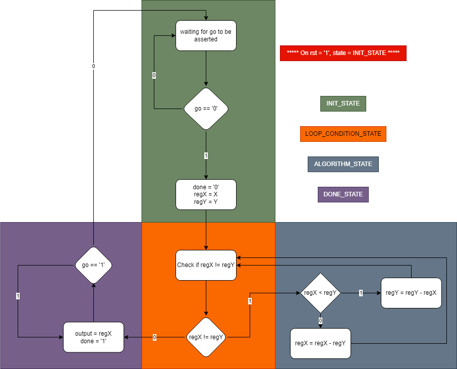
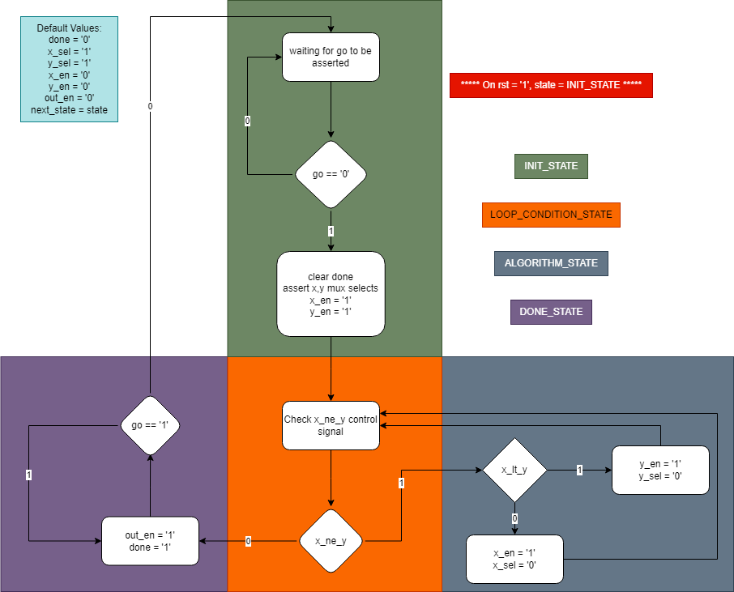

# Greatest Common Denominator (GCD) Calculator

*** Before discussing the design, refer to gcd.txt for the pseudocode of the algorithm. ***

The GCD calculator was designed and synthesized using 3 different architectures:
* FSMD - 1-process model Finite State Machine with Datapath operations included in the FSM.
* FSM_D - An FSM (2-process model) that will control a separate Datapath (structural architecture) entity via control signals.
* FSMD2 - 2-process model FSM with datapath operations included in the FSM.

Each architecture was tested using a testbench and simulations ran as expected. The RTL viewer of the synthesized design matches the schematics.

## FSMD 
Below is a pictorial representation of the FSMD developed in VHDL.

## FSM + Datapath
The FSM shows the control flow logic, while the datapath shows how each component is connected.

